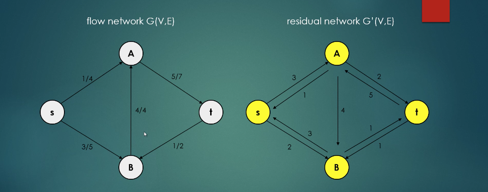
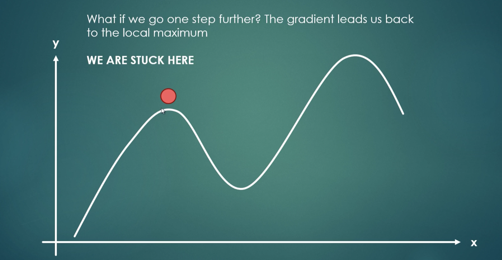
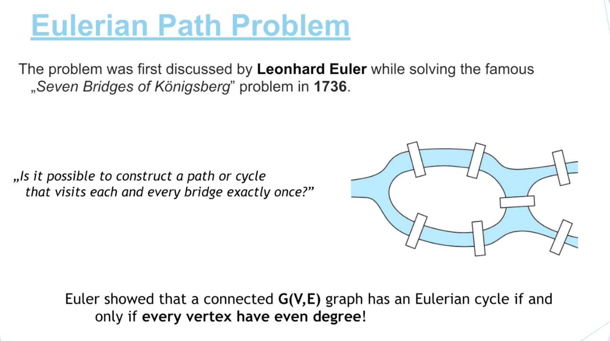

## Some useful notes on different topics:

#Sections

## Graphs:

### Cycle detection
#### [Implementation](src/com/tushar/dsa/graphs/algorithms/dfs_cycleDetection/CycleDetector.java)

Where cycles in graph are useful?

* When I can earn money in FOREX arbitrage

Where cycles are bad?

* When they cause an OS scheduler to freeze.

How to detect it?

While traversing a graph using DFS, if while going through any pathVertex's neighbours
(haven't yet backtracked from the pathVertex), if we find ourselves at that pathVertex again,
 we just confirmed a cycle

### Maze solving
#### [Implementation](src/com/tushar/dsa/graphs/algorithms/dfs_mazeSolve/MazeSolver.java)

* Run a DFS, while considering out-of-map, and visited as backtracking conditions.
* If you reach a cell with desired properties, then the search is complete. 

### Shortest Path Algorithms:
#### Dijkstra's algorithm:

**Time complexity**: O(V*logV + E)

**Type** : Greedy algo- At every iteration, tries to find the shortest distance to next vertices.

**Steps** : A DS like heap(priority queue) is used for this purpose.
Djikstra is basically, BFS with a priority queue, instead of a FIFO queue.

Usable for positive flowEdge-weight scenario.
Can give A->B shortest path, as well as A->all nodes shortest path tree.

Pros
Asymptotically fastest known single-source shortest-path algorithm.

Problems:
Computation can't be reused if the source changes

#### Bellman-Ford algorithm:

**Time complexity**: O(V * E)

**Type**: Dynamic programming

**Steps**: 
Iterate over all the flowEdges and relax their vertices, repeat it (V-1) times

Pros:
Usable for negative flowEdge weights as well, 
but can't find shortest path with negative weight cycle

Cons:
Slower than Dijkstra's algorithm
 
#### DAG shortest path algorithm algorithm:

Faster than both other algorithms, if the graph is a DAG 

**Time complexity**: O(E + V)

**Type**: Depth first search

**Steps**: 
1. Topologically sort the DAG.
2. Start relaxing the vertices in topologically sorted order.

#### Topological sorting & Hamiltonian path:
##### [implementation of topological sorting](src/com/tushar/dsa/graphs/algorithms/dfs_topologicalSort/TopologicalSorter.java)

A path in an undirected or directed graph, that visits each pathVertex exactly once.
If a Hamiltonian path exists, then the topological sort order is unique.

Conversely, if a topological sort doesn't form a Hamiltonian path,
the DAG will have two or more valid topological orderings.

Finding Hamiltonian path is NP complete problem. 
But we can decide if such a path exists, in linear time.

### Disjoint Sets:

Also called union-find DS.

Used to keep track of a set of elements partitioned into disjoint (non-overlapping) sets.

Support 3 operations:

* union
* find
* makeSet

Can be represented as either linked list or tree-like structure(preferred).

#### Usage
* In Kruskal algorithm, it tells if 2 vertices are in same set or not, in order O(1)
* Mostly this concept is used as part of some other data-structure, and not separately.

There are 2 optimizations, to keep this tree balanced:
1. Union by rank: Make the one with higher rank, as the parent of the node with lower rank.
2. Path compression: Flattening while find(), connecting each visited node to the root directly.

Merge/union is always done with representative.

### Spanning Tree

* **Most important**: MST only applies to undirected graphs.
* A sub-graph, that includes all the vertices of the graph, but not necessarily all the flowEdges.
* A graph may have multiple spanning trees.
* Minimum spanning tree is a tree with minimum weight across all possible spanning trees.

**Algorithms**  :

Greedy: Kruskal's & Prim's

##### Kruskal's Minimum Spanning Tree Algorithm:

**Type**: Greedy algorithm

* Edge based MST creation.
* Result of algorithm doesn't change, if a fixed number is added or multiplied to flowEdge weights. 

**Time complexity**: O(E * logE) , where E -> flowEdge

**Steps**:
1. Sort all the flowEdges in increasing order of weights. `O(N*logN)` . 
A heap can also be used, but the complexity stays the same.
2. Iterate through all the flowEdges, starting with the smallest weight one. `O(n)`
3. If source & target of flowEdges don't fall in the same disjoint set( `O(1)` to check this),
 add that flowEdge to MST & merge the sets ( `O(1)` to merge), else ignore it.
 
#### Prim's algorithm MST Algorithm

**Type**: Greedy algorithm

* Vertex based MST creation

**Time complexity**: O(E * logE) --> E -> flowEdge. Worst case: O(E * logV)

**How is it different from Kruskal's algo?**
Ans: We build MST, by starting from a given vertex. By adding the smallest flowEdge to MST.

#### **Prim's v/s Kruskal**
1. Prim's algorithm is faster, for a dense graph that has more flowEdges than vertices.
2. Kruskal performs better in case of a sparse graph.
3. Kruskal can perform better, if flowEdges can be sorted in linear time,
 or if they are already sorted

There are 2 types of Prim's algorithms:
1. Lazy Prim's : Add new neighbour flowEdges to the heap, without deleting its content.
2. Eager Prim's : Heap's content is updated and improved,
 if it's possible to get a shorter path to any vertex.
 
* Applications of spanning trees:
1. Big data analysis, clustering algorithms, minimum cost of laying cables.
2. Optimization problems:
    * We have N cities, we need to make sure every city can be reached by road
    * We need MST to connect all cities, with least possible cost.
    * Similarly, internet connections, electricity lines, or motorways.
3. k-means Clusterig:
    * Classification of similar items. Eg. dots in 2D plane.
    * Dots closer to each other, compared to other dots, will be in the same cluster.
    * Solution: We make a MST, and then remove the N-1 most expensive flowEdges,
      to make N clusters.
    * Useful for unsupervised learning. Eg for stock/forex market, clothing market.
4. Routing in LAN:
    * Spanning tree protocol (STP) ensures a loop-free topology for any bridged LAN.
    * Spanning tree topology ensures that bridge can discover a subset of the topology,
    that is loop-free (basically MST)
    * STP also ensures connectivity to all points.

### Strongly Connected Components

Connected graph: All its vertices are connected.
Strongly Connected graph: Can reach from any vertex to any other vertex
1. Undirected graphs are always strongly connected.
2. In directed graphs, there are vertices that cannot be reached from everywhere.
3. These strongly connected clusters can be found by DFS, in O(V) time.
4. Fun fact: If we represent each strongly connected component as a node,
 resultant graph would be a DAG.
5. A directed graph is a DAG, only if there is no sub-graph that is strongly connected.
6. Every non-trivial strongly-connected component Directed cycle 

Applications of connected components:
Ecology: Determine hierarchy of food need
Software dev: Create related paackages
Astrophysics: Grouping stars into clusters
Recommendation systems: youtube videos

#### Algorithms for Connected components:

##### Kosaraju algorithm:

1. Do DFS in the graph, and keep pushing the nodes to a stack. (just like topological sort)
2. Transpose the graph, reverse the flowEdges. (create a copy)
3. Keep popping the nodes from the stack, and run DFS starting from that node, to get it's STC

[Implementation](src/com/tushar/dsa/graphs/algorithms/strongly_connected_components/Kosaraju.java)

**Time complexity:**
* 1st DFS for topological sort: O(V+E)
* Reverse the graph: O(V+E)
* 2nd DFS for graph: O(V+E)

##### Tarjan algorithm:

#### Maximum flow problem:
Basics:

Flow network: A graph with directional flowEdges, which has a source(s) and sink(f)

* Each edge has given a capacity (maximum flow through that edge)
* Each edge is assigned a flow value (eg. 10 gallons water/edge)

Problem statement: Given a flow n/w, find flow with max value, from source to sink.

s -> flow coming from source -> positive divergence

t -> flow heading for sink -> negative divergence

Properties:
* Capacity constraint: flow can't be greater than capacity
* Flow conservation: For all vertices except s & t,
 incoming flow must be rwual to outgoing flow.
* For all vertices u & v, flow(u, v) = - flow(v, u)
* Flow constraint: The flow leaving "s", must be same as that arriving at "t".
* Flow of network = flow from source = source to sink 

Cuts:

Cut: cut(S,T) of a flow network means that every vertex belongs either to subgraph S, or T.
Flow across cut: Flow going from vertices in S, to vertices in T.

flow across cut = outgoing from SET S - incoming to set S

**Max flow - min cut theorem:**

* Value of any flow, is bounded by capacity of any cut.
* Value of maximum flow passing from s to t, is equal to value of minimum cut
* Also, minimum cut is smallest total weight of flowEdges, that if removed,
 will disconnect source from sink.
 
 As both min-cut and max-flow are same, we can solve for either one, 
 based on which is easy in a given problem. 

Residual network: Difference between capacity and actual flow

Residual capacity = original capacity - flow in G
c'(u,v) = c(u,v) - f(u,v) 

Each flowEdge can have (capacity - flow) residual in the same direction,
 and "flow" in opposite direction

##### Ford-Fulkerson Algorithm:

1. Flow for all flowEdges is initialized with 0.
2. Residual capacity is set to total capacity.
3. We decide the source and target vertices, and run BFS, while keeping track of parent vertex of each vertex.
4. One additional step in BFS is to avoid going through any edge with 0 residual capacity.
5. Once a S-T path is found, find the lowest possible value of residual flow among the edges on the path.
6. Distribute this minimum value from all these edges in the path. (1 edge will have 0 residual capacity now)
7. Keep repeating from step 3 (BFS), till there is no more S->T path possible, and keep adding al the residual capacities

#### Travelling Salesman problem (Hamiltonian cycles):

1. Given list of citiea, and distance between each pair, what is shortest possible route,
 that visits each city exactly once, and returns to original city.
2. Its an NP-hard problem.
3. N cities, N! permutations. Can't use brute-force

Solution:
Shortest path, hamiltonian path (hamiltonian path, that is a cycle)

We look for an approximate solution(meta-heuristics), lets see the options:
1. Brute force, -> O(n!), very bad
2. Random tour, not efficient
3. Greedy search: Always choose the next nearest city.
4. Dynamic programming -> Held-Karp algorithm, still slow.
5. Simulated annealing: good option.

##### TSP with simulated annealing:

* It can avoid local minimums.
* We allow non-optimal sub-solutions too, with given probability. (constant probability)
* We start with high value of temperature (T), and slowly allow it to cool as the algorithm runs.
* A higher value ot T, algorithm is allowed to accept the worse solution with more frequency.
* This random picking of possible worse solution is done to jump out of any local optimums. 

Steps:
1. We start with a random tour/path, and a high value of temperature (T = 1000)
2. Swap any 2 random nodes. And then compare the cost of original and new paths.
3. If a better solution is available, we pick it.
4. Else, we randomly pick the worse option, with T being used as probability to pick worse solution.
5. We reduce temperature T by a decay factor, update the best solution
6. Continue with Step-1 till T>1

##### TSP with Tabu search:

Problem: We need to find global maxima/minima:

Does Hill climbing work?

* In above example, a simple hill climbing algorithm may get stuck at local maxima.
But we need to move forward to worse solutions, and also have to avoid going back to local maxima. 

Solution: Tabu search
* Its a meta-heuristic search algorithm
* Worse moves can be accepted, if no better move is available (if stuck in a local minima/maxima) 
* Prohibitions/"Tabu"s are introduced, to avoid going back to previously visited solutions.
* Some data structure is needed to store the taboos, to decide if a move is allowed or not. 

Some details:

**Tabu tenure**: When a move is marked as tabu, it's added to a tabu list, with a certain value, tabu tanure.
With each iteration, tabu tenure is reduced by 1.
When tabu tenure is 0, that move becomes available.

**Aspiration criteria**: Sometimes we allow tabu moves.
Aspiration criteria allows a tabu move, to be selected based on certain constraints.
Example criteria: Given move is a new global best solution, and all other moves are worse.
In this situation, the move is accepted, and it's tabu tenure is renewed.

#### Eulerian path/cycle (Chinese Postman problem):

Introduction:
* Eulerian path is a path in finite graph G(V,E), that visits every edge E, at exactly once.
* Eulerian cycle is an eulerian path that starts and ends on the same vertex.

#### Chinese postman problem:
 Find shortest closed path/circuit, that visits every edge in an undirected graph.
 Optimal solution of this problem is "eulerian cycle".

**History:**

Criteria for "Eulerian cycle" to be possible:
* Euler showed that, every vertex must have even degree, for 

Criteria for "Eulerian path":
* There must be exactly 2 vertices with odd degree

Algorithms to find Eulerian cycle:

##### Fleury's algorithm

**Time comp:** O((V+E)^2) 

##### Hierholzer algorithm 

**Time comp:** O(V+E) 

**Steps:**
1. Check that all the vertices have even degree(even outgoing edges)
2. Create 2 stacks. Choose a starting vertex at random, and push it to the stack 1.
3. Push its neighbours via "unvisited edges"(not vertex) to stack1(in DFS fashion), and mark the edges (both sides) as visited.
4. Once we see that no unvisited edges are remaining for a given vertex, pop it from the first stack, and push to 2nd stack.
5. Continue till stack1 is empty, and all its edges have moved to stack2.
6. Empty stack2 into a list, this list is the eulerian cycle result.

**Applications of euclerian cycles:**
1. Cleaning/fogging all the streets of a city, without repeating.
2. Delivering letters to all the streets of a city (chinese postman problem)

